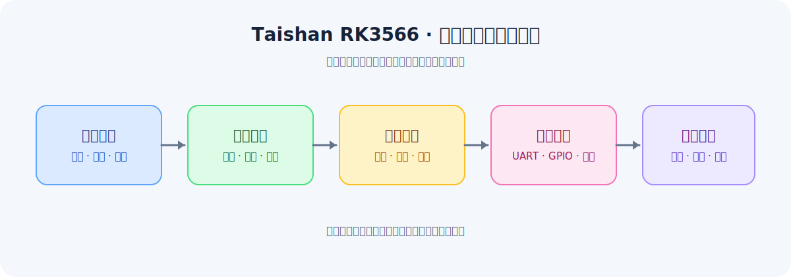

# 泰山派 RK3566 电赛视觉 Skill

> 面向电赛视觉的 RK3566 Linux 工程验证型 Codex Skill。


当前公开版本：**v1.0.0**

它帮助使用立创·泰山派 RK3566 参加电赛视觉类题目，围绕“题目约束、板端能力、视觉方案、通信边界和验收证据”组织整个开发过程。



> 配图占位符：后续可替换为项目架构图、板端实物图或电赛视觉工作流示意图。

## 这个 Skill 解决什么问题

电赛视觉项目中，真正容易浪费时间的往往不是某一个 OpenCV 函数，而是：

- 题目目标、评分条件和误差要求没有拆清楚；
- 电脑上能运行，板端却打不开摄像头或串口；
- 物理引脚、GPIO 编号、设备树和 Linux 设备节点混在一起；
- 视觉处理频率、控制发布频率和 UART 协议没有分层；
- 方案还没有验证，就直接开始写完整工程；
- 已有项目改动过大，出现难以定位的回归问题。

Taishan Skill 的作用，就是把这些问题变成可检查、可验证、可复用的工程流程。

## 核心工作流

```text
赛题约束
  -> 视觉任务分类
  -> 传统视觉 / 测量 / 跟踪 / 模型方案比较
  -> 首次使用门禁与板端能力探测
  -> 最小视觉验证
  -> 坐标、通信和执行闭环
  -> 性能与评分验收
```

它参考 [MaixCAM-skill](https://github.com/LanHua01/MaixCAM-skill) 的工程方法，但不复制 MaixPy、MaixVision 或固定赛题代码。

## 快速开始

### 1. 在 Codex 中调用

可以直接提出：

```text
使用 $taishan-rk3566 分析这道电赛视觉题，
先完成首次使用检查和题目约束卡，再给出可验证的方案。
```

也可以针对具体任务调用：

```text
使用 $taishan-rk3566 分析这道单目标视觉测量题，
先比较颜色分割、几何检测和模型方案，
不要直接写完整工程。
```

首次使用时，Skill 会优先确认：

- 当前板卡、系统和内核；
- 摄像头设备、格式和实际采集能力；
- UART、GPIO、RKNN 运行时等板端条件；
- 题目中的视觉目标、误差、时限和执行机构边界。

### 2. 在泰山派板端采集证据

通过 VS Code Remote-SSH 连接板端后，在仓库目录执行：

```bash
bash scripts/run_baseline.sh --output-dir baseline-YYYYMMDD
```

也可以单独运行探针：

```bash
bash scripts/probe_system.sh --text
python3 scripts/probe_camera.py --json --frames 30
python3 scripts/probe_uart.py --json --baudrate 115200 --read-seconds 1.0
python3 scripts/probe_gpio.py --json
python3 scripts/probe_rknn.py --json
```

探针默认以只读、低风险方式收集信息。实际摄像头、串口和 GPIO 设备名以板端输出为准，不要直接照抄其他设备的节点或编号。

### 3. 把证据交给 Skill

将板端生成的 JSON、文本输出或日志交给 Codex，并说明：

```text
这是我的泰山派板端探针结果。
请根据真实输出更新环境摘要，
指出当前题目方案还缺哪些验证，
然后给出最小可执行步骤。
```

Skill 会把“已在板端执行的事实”和“待验证的假设”分开处理，避免把电脑上的结果误认为板端结果。

## 面向的电赛视觉任务

当前工作流适合处理以下类型：

- 颜色、亮度和区域分割；
- 直线、矩形、圆、轮廓和几何测量；
- 静态目标定位与中心误差计算；
- 运动目标跟踪和状态判断；
- 视觉瞄准、云台控制和闭环执行；
- 空间盘点、货架、棋盘或多目标位置判断；
- 传统 OpenCV 与 RKNN 模型方案的选择；
- 摄像头、UART、GPIO、MSPM0 和执行机构之间的职责划分。

重点不是预先规定一种算法，而是根据题目约束和真实板端能力选择最小可靠方案。

## 目录结构

- `SKILL.md)：触发描述、首次使用门禁和核心工作流；
- `references/`：板端运行时、视觉任务、工程架构、调试、研究资料和验证方法；
- `templates/`：题目需求、快速验证、方案矩阵、串口协议、工程结构、性能和验收模板；
- `scripts/`：系统、摄像头、UART、GPIO、RKNN 探针，以及统一保存证据的 `run_baseline.sh`；
- `agents/openai.yaml`：Skill 在 Codex 中的界面信息。

## 工程边界

- 不假设所有用户使用相同的 Linux 镜像、摄像头、设备节点或串口协议；
- 不根据 40 针编号直接猜 Linux GPIO 数字；
- 不在缺少板端证据时，把桌面电脑上的 FPS、OpenCV 行为或模型结果当作实测；
- 不默认发送 UART 数据或申请 GPIO line；
- 不把 MSPM0、云台、电机或安全控制的职责未经确认地转移到 RK3566；
- 通过 Remote-SSH 工作时，明确区分 VS Code 界面、板端终端和 Codex 当前可访问的环境。

## 板端验证参考

仓库提供探针和模板，用于建立一套可复查的板端证据：

- 系统、镜像、内核和工具链；
- 摄像头设备、格式、分辨率、帧率和首帧；
- UART 设备存在性、打开结果和监听信息；
- GPIO chip 可见性及工具状态；
- RKNN Lite、运行库和 NPU 相关运行时信息；
- 后续的性能、延迟、资源和稳定性记录。

这些结果用于帮助 Skill 做出更贴近真实板端的判断。具体设备路径和性能参数始终以用户自己的板端输出为准。

## Remote-SSH 与 Codex 的边界

VS Code Remote-SSH 可以让用户在 VS Code 中操作泰山派板端 Linux，但 Codex 是否能直接执行远程终端命令，取决于当前运行环境。

如果 Codex 只能访问本地工作区，用户需要在 VS Code 的 Remote-SSH 终端执行 `scripts/` 下的探针，再把输出或 JSON 证据交给 Codex。Skill 不会把尚未执行的命令描述成板端验证结果。

## 参考资料

- [立创·泰山派 RK3566 官方 Wiki](https://wiki.lckfb.com/zh-hans/tspi-rk3566/)
- [泰山派开源硬件项目](https://oshwhub.com/li-chuang-kai-fa-ban/li-chuang-tai-shan-pai-kai-fa-ban)
- [IO 分配表](https://wiki.lckfb.com/zh-hans/tspi-rk3566/documentation/io-allocation-table.html)
- [MaixCAM-skill](https://github.com/LanHua01/MaixCAM-skill)

## 版本管理

本项目使用语义化版本号，并以 Git tag 作为发布标识：

- `v1.0.x`：修复错误、文档整理和兼容性修正；
- `v1.x.0`：增加新的题型方法、探针或工程能力；
- `v2.0.0`：出现不兼容的 Skill 工作流或接口变化。

当前基线版本记录在仓库根目录的 `VERSION` 文件中。每次发布时同步更新该文件、README 版本标识和 Git tag。

原始原理图、竞赛题目 PDF、个人工程和未授权模型不直接打包到公开 Skill；来源和适用范围记录在 `references/source-index.md`。
